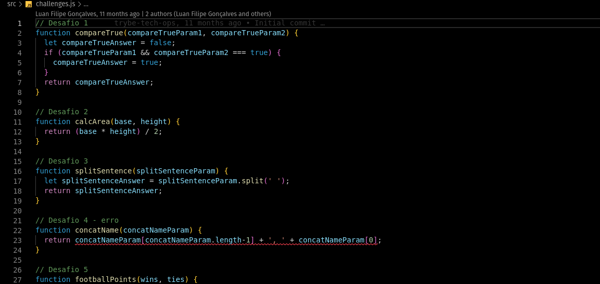

<!-- Introdução -->
<h1 align="center"> Projeto PlayGround Functions - :two: </h1>

<!-- Descrição -->

Este é meu segundo projeto desenvolvido em minha jornada de aprendizado como desenvolvedor na Trybe,
nele desenvolvi funções diversas para demonstar conhecimentos básicos em JS.

#
<!-- Habilidades -->
<h2 align="center"> Habilidades Desenvolvidas: </h2>

* Utilizei _JS_ para resolver problemas pré-determinados. :heavy_check_mark:
* Apliquei _Lógica de Programação_ para analisar e solucionar problemas. :heavy_check_mark:
* Utilizei _Funções e Operadores lógicos_ para construir um código dinâmico. :heavy_check_mark:

#
<!-- Preview -->
<h2 align="center"> Preview: </h2>

  

    
  

#
<!-- Ferramentas utilizadas -->

  

	  <h2>Ferramentas e Tecnologias utilizadas:</h2>
	

  

  | Linguagens              |
  | :---------------------- |
  | JavaScript              |

  

#
<!-- Instalação e utilização -->

  

    <h2>Como instalar e utilizar o projeto:</h2>
  

  

    <h3>Especificações Tecnicas:</h3>
  

  

  
  * Git - <i> `git -v` informará a versão em uso.</i>

  

  #

  

    

      
      1. Faça a clonagem do projeto - <i>Este projeto não utiliza dependências externas</i>
      > `git@github.com:luanfgoncalves/project-playground-functions.git`
      2. Abra challenges.js e challenges2.js- <i>As funções podem ser testadas atrávés da extensão `Code Runner` no VScode</i>
      > Todas as funções e desafios realizados estão dentro de `/src`.

    

#
<!-- Meu contato -->
<h2 align="center"> Se conecte comigo: </h2>

  
  
   

